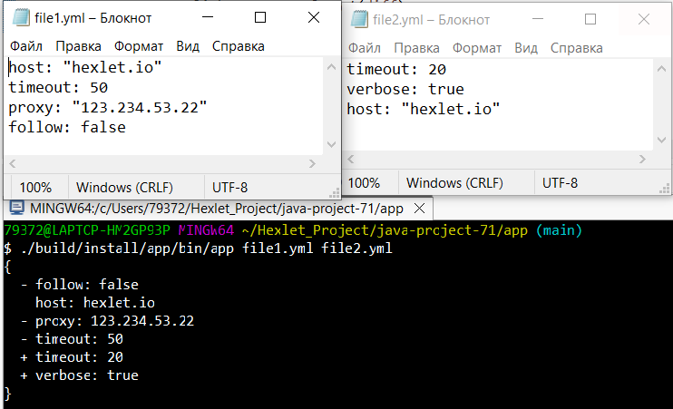
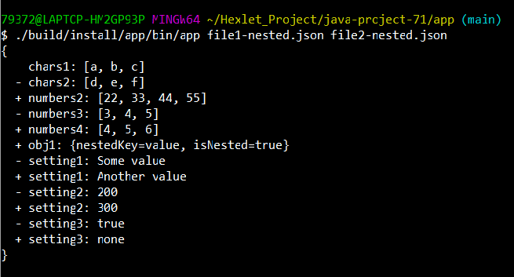
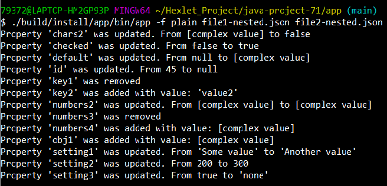
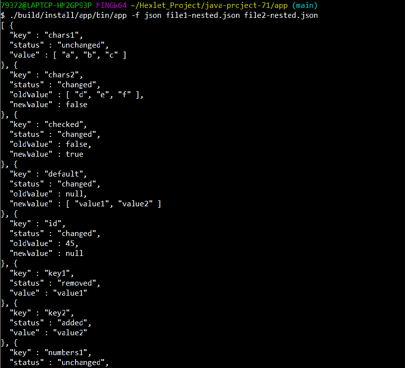

### Hexlet tests and linter status:

Compares two configuration files and shows a difference.

### Сравнение JSON файлов (формат stylish)

### Сравнение YAML файлов (формат stylish)

### Сравнение вложенных структур (формат stylish)

### Вывод в формате plain

### Вывод в JSON
